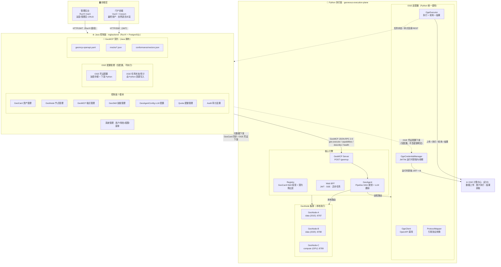
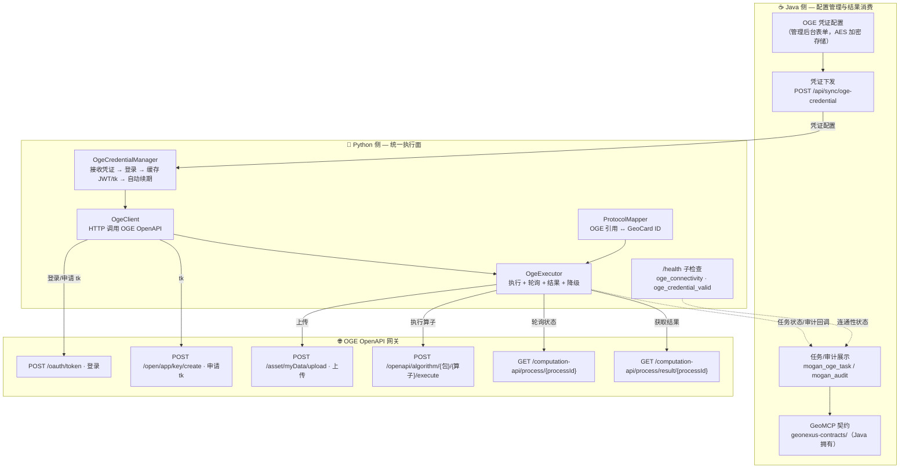
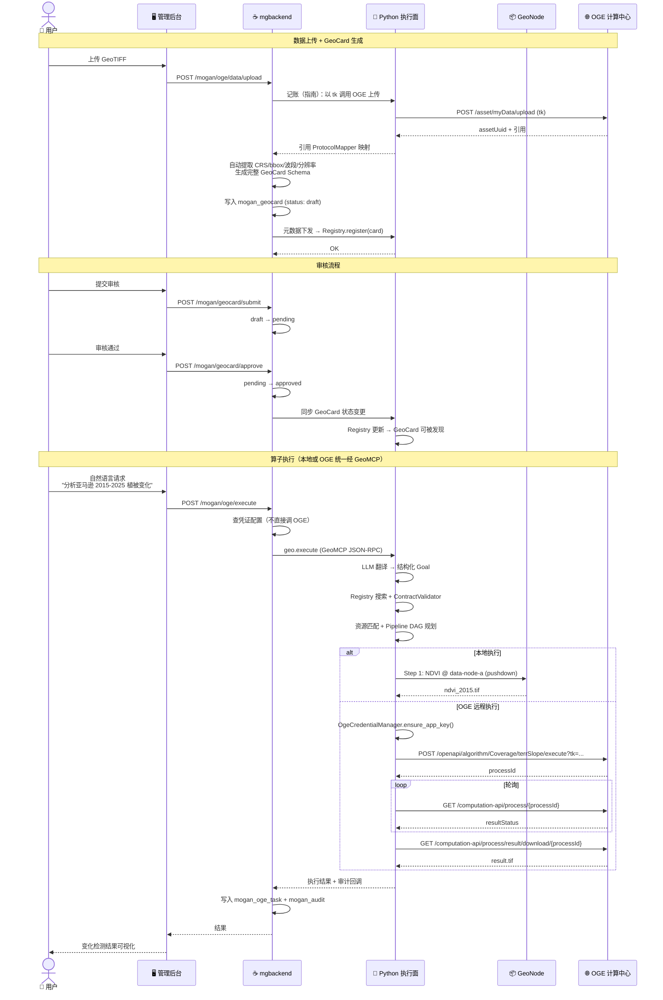
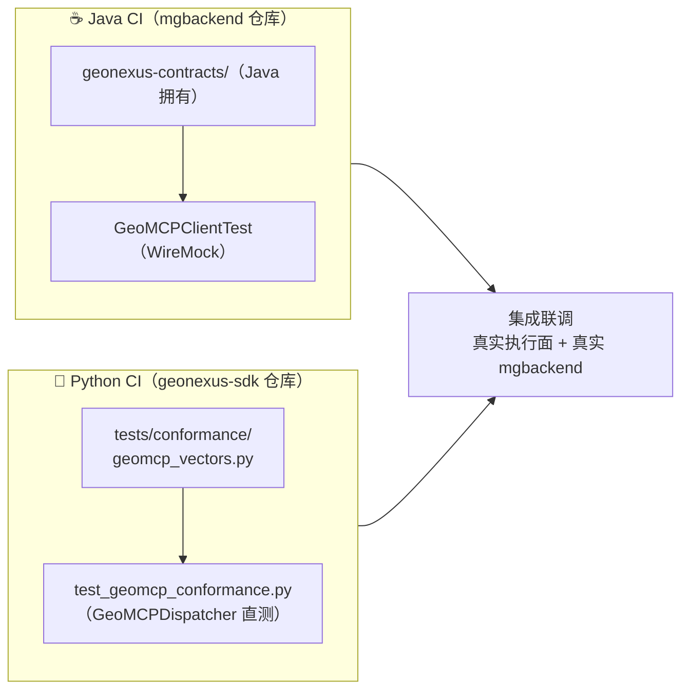

# GeoNexus 后台架构图（Mermaid）

> 已确认的架构决策（v2）：
> 1. **Java 管"管"，Python 管"算"**：Java mgbackend（RuoYi）是管理面，Python 执行面是计算面。
> 2. **OGE 由 Python 统一调用**：OGE 是 Python 执行面的一个远程 adapter，Java 不直连 OGE 执行链路。
> 3. **契约归 Java 仓库拥有**：`geonexus-contracts/` 由 Java 团队维护；Python 团队通过 SDK 的 `tests/conformance/` 保证实现正确，两边 CI 各自独立验证，集成时对齐。

## 1. 总体架构图

## 2. OGE 交互架构（OGE 统一由 Python 调用）

## 3. 核心执行全链路（时序图）

## 4. GeoCard 完整工作流（5 步协调）

```mermaid
graph LR
    subgraph Step1["① 检索 Retrieve"]
        R1["Registry.search<br/>type=data<br/>bbox + capability"]
        R2["发现 data cards<br/>+ model cards"]
    end

    subgraph Step2["② 契约 Contract"]
        C1["ContractValidator.check<br/>CRS · bbox · temporal<br/>bands · resolution"]
        C2["✓ satisfied<br/>✗ rejected + reasons"]
    end

    subgraph Step3["③ 算力 Resource"]
        S1["match_resource<br/>model.runtime vs<br/>compute cards"]
        S2["gpu=cuda → GPU node<br/>gpu=none → rejected"]
    end

    subgraph Step4["④ 规划 Plan"]
        P1["GeoAgentPlanner<br/>Pipeline DAG"]
        P2["Step1: NDVI @ node-a<br/>Step2: NDVI @ node-b<br/>Step3: Change @ GPU node<br/>(depends_on: [1,2])"]
    end

    subgraph Step5["⑤ 执行 Execute"]
        E1["PlanExecutor.run<br/>拓扑排序 · pushdown"]
        E2["计算移动到数据<br/>数据不出节点"]
    end

    Step1 --> Step2 --> Step3 --> Step4 --> Step5
```

## 5. 契约验证职责划分（CI 各自独立）

