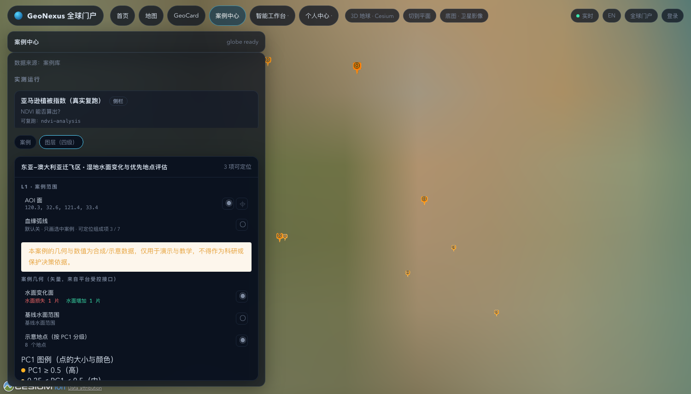

# 教学演示：候鸟—湿地案例怎么讲

一份可以照着念的操作路径。目标是**五分钟讲清三件事**：一个研究案例在平台上长什么样、
地图上能看到什么、以及"看不见"为什么也是设计的一部分。

> **先说数据性质**：这个案例的全部几何与数值是**合成/示意**数据，界面会显式标注
> 「不得作为科研或保护决策依据」。它演示的是**能力与方法链路**，不是 EAAF 的真实结论。

---

## 一、准备（一次性，约 30 秒）

```bash
cd tmp/platform-repo

# 两种可见性模式，按讲课需要二选一：
node scripts/seed-flightway-case.mjs --public   # 开放演示：访客可见（课堂/展台用）
node scripts/seed-flightway-case.mjs            # 默认：含受限点位 ⇒ 访客 404（讲治理用）

npm start          # 平台 BFF，默认 http://127.0.0.1:3301
```

种子脚本做的事：案例本体、三个组成项（两份公开数据 + 一份**受限**精确点位）、方案绑定
（含方案全文）、三个交付物、三份几何（水面变化面 / 基线水面 / 点位）。全部落在平台自己的
`data/geonexus.db` 与 `uploads/cases/flightway/` 下。

## 二、操作路径（照着点）

| # | 操作 | 应该看到 |
|---|---|---|
| 1 | 打开 `http://127.0.0.1:3301/cases` | 案例库里有一条「东亚—澳大利亚迁飞区 · 湿地水面变化与优先地点评估」 |
| 2 | 点这条案例 | 地球上飞到黄海—渤海示意窗口，出现**案例 AOI 面** |
| 3 | 抽屉里点「图层（四级）」 | 出现：案例几何、PC1 图例、地点详情、L1–L4 四级、双时间轴 |
| 4 | 看「案例几何」一节 | **水面变化面**：损失（暖色）与增加（青色）分别有片数与计数；**地点**：8 个按 PC1 分级的圆点 |
| 5 | 点地图上的任意一个圆点 | 「地点详情」出现该点的 PC1、分级、达标种群数、其中受威胁数、保护状况 |
| 6 | 点面板里的地点行 | 同上（地图点击、面板行、列表行是**同一份状态**） |
| 7 | 打开「基线水面范围」开关 | 基线水面轮廓出现 —— 与变化面对比就是"这十几年少了什么" |
| 8 | 在 L3 点报告交付物（▤） | L4 展开报告：结论、方法、优先地点表、**局限** |
| 9 | 拖动 L2 播放 | 按执行顺序走一遍步骤足迹；双时间轴上方是数据时间、下方是执行时间 |

## 三、讲什么（三句话）

1. **一个研究案例不是一个文件**：它由"两份数据 + 四个算子 + 三个交付物"组成，
   卡片说这是什么、方案说怎么跑、交付物是结论 —— 三层分开，才能被复用（`fork` 改参数重跑）。
2. **图上看到的是真几何，不是示意图**：水面变化面是把栅格矢量化后的多边形，点按 PC1 分级
   （同一份色板驱动地球与图例，不会"颜色对不上"）。栅格本身仍在交付物里可下载。
3. **"看不见"也是功能**：案例外壳是公开的，但它引用了**受限的精确点位**（精确坐标会指向
   可被干扰的停歇地）。按可见性继承规则，整案对访客**不存在（404，不是 403）**；
   管理员看得到，并且能查到"为什么被挡"。

## 四、讲治理时用默认模式

```bash
node scripts/seed-flightway-case.mjs     # 回到默认：含受限点位
```

然后：

| 操作 | 应该看到 |
|---|---|
| 匿名（未登录）打开 `/cases` | 列表里**没有**这条案例（连"藏了一条"都不暗示） |
| 匿名直接访问 `/api/cases/case-eaaf-wetland-priority/layers` | **404 · 案例不存在** |
| 匿名访问 `/api/cases/case-eaaf-wetland-priority/geometry/sites` | **404** —— 几何与图层同一道门，不能绕过 |
| 管理员登录后再看 | 正常显示，`visibility=restricted`，且审计里留下 `case.hidden`（含档位与原因） |

为什么是 404 而不是 403：403 等于承认"存在一个你看不到的案例"，而"某地有研究"本身就是信息。

## 五、边界（讲课时建议主动说明）

- 数据是**合成/示意**：地点叫"示意地点 01…08"，坐标落在示意窗口内，不是论文的 147 处地点边界；
- 论文的地点边界由各国专家核定，属于待补的数据槽位（见 SDK 侧 `docs/cases/flightway-wetland.md`）；
- PC1 阈值样例配置为 0.2，论文的区域校准是 10/1（270+ 种群尺度）；`--pc1-threshold 10`
  在样例数据下零入选，这是尺度差异，不是链路坏了；
- 案例目前跑在**一个示意窗口**上；"迁飞网络"（147 处、跨十国）还没有建模，属于模版级缺口。

## 六、排查

| 症状 | 原因 | 处理 |
|---|---|---|
| 案例列表为空 | 默认模式下访客看不到（含受限点位） | 用 `--public` 重种，或管理员登录 |
| 地球上看不到几何 | 几何文件不在 `ARTIFACT_ROOTS` 白名单内 | 启动平台时把 `uploads/` 加进 `ARTIFACT_ROOTS`（测试里就是这么做的） |
| 面板出现「部分几何加载失败」 | 某一份 GeoJSON 取不到 | 看平台日志与 `uploads/cases/flightway/` 是否存在 |
| 改了前端但页面没变 | 平台服务的是 `frontend/dist` 构建产物 | `cd frontend && npm run build` 后刷新 |
| L4 报告面板空白或显示 401 | 交付物下载**需要登录**（产物是受控读取，与产物白名单同一策略） | 用管理员/机构账号登录后再点 ▤ |

---

## 七、真机截图与实测记录（首次可视化验证）



用 `scripts/shoot.mjs`（零依赖 CDP + 无头 Chrome）实测，发现并修掉了**三个只有真机才会暴露的问题**：

| # | 症状 | 根因 | 修法 |
|---|---|---|---|
| 1 | 地球**全黑**、状态显示 `offline`，控制台 `ReferenceError: Cesium is not defined` | 拾取处理器写在了 `mount()` 开头，而 `Cesium` 是之后 `await loadCesium()` 才有的 | 移到加载完成、viewer 建好之后 |
| 2 | 面板里几何齐全、地球上什么都没有（`dataset.caseOverlay` 未设置） | 子组件 `onMounted` 先于父布局里的地图挂载：叠加层比引擎先到就被丢掉了 | 引擎侧把最后一次叠加层与相机请求**排队**，就绪后补画；门面在挂载/切引擎后重放 |
| 3 | 控制台 `crs.properties is undefined`，面画不出来 | 导出的 GeoJSON 带了非标准 `crs` 字符串成员；RFC 7946 已废弃它，Cesium 会当对象解析 | 导出器不再写 `crs`（坐标一律 EPSG:4326，投影信息只放 manifest） |

实测探针（`window.__gnxGlobe`）确认几何**确实画上去了**：

```
相机: height 748 km, lon 120.52, lat 32.91（案例 AOI 内）
water_change: 857 个实体 / 全部多边形 / 材质 rgba(255,107,107,0.85)（损失色）
sites: 8 个 billboard
```

**还没解决的一点**：在无头 Chrome（软件渲染）里，该缩放级别的卫星底图瓦片没有加载完，
背景是一张模糊的放大瓦片，因此**"红/青斑块在真实底图上的可读性"这次没能被眼睛确认**。
已知的原因是合成数据的水面本身是**碎片化**的（3845 个损失像元被分成 857 个小斑块，
每块约 1 公里），在 748 km 视高下每块只有几个像素。建议下一步二选一：
调近一点看单个地点，或把矢量化的最小斑块阈值提高后再导出。
