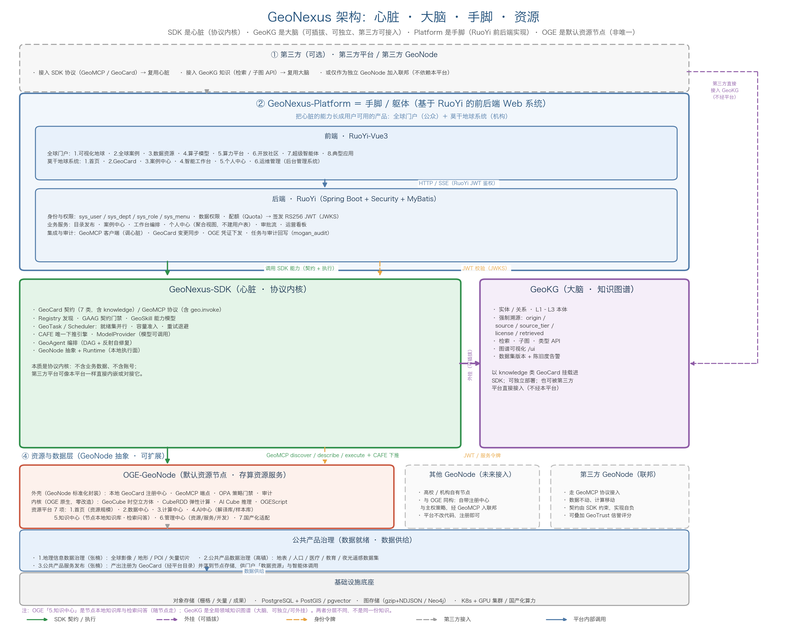
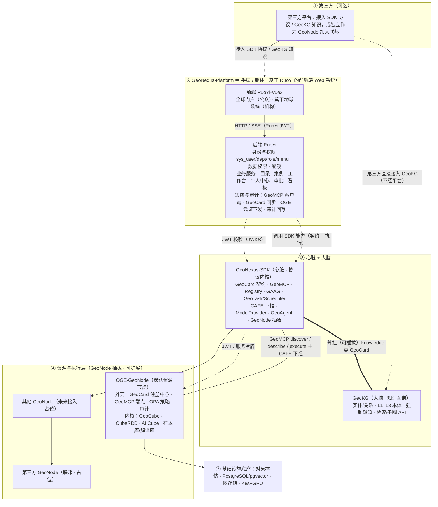

# GeoNexus 架构：心脏 · 大脑 · 手脚 · 资源

> 本文是 GeoNexus 平台侧的**常青架构文档**（替代早先的 `platform-architecture-v3.md`）。
> 图示：`docs/images/platform-architecture.png`（生成脚本 `docs/make_architecture.py`）
> 关系：**沿用** `docs/architecture-diagrams.md` 的 v2 决策（管算分离、OGE 只由执行面调用、契约归 Java 仓库），
> 并按"器官"模型重新校准四者定位（见第五节差异说明）。

---

## 一、一句话讲清四个系统

| 系统 | 器官 | 它是什么 | 关键含义 |
|---|---|---|---|
| **GeoNexus-SDK** | **心脏** | 协议内核：GeoCard 契约、GeoMCP 协议、GeoSkill 能力模型、GeoTask/Scheduler、CAFE 下推、ModelProvider、Agent 编排、GeoNode 抽象 | 所有能力都从这里泵出去；**不含业务数据、不含账号**。第三方平台可像本平台一样直接内嵌/对接它 |
| **GeoKG** | **大脑** | 地理领域知识图谱：实体/关系、L1–L3 本体、**强制溯源**、检索/子图 API、可视化 | **可插拔**：可独立部署、可外挂 SDK（以 `knowledge` 类 GeoCard 挂载）、**也可被第三方平台直接接入** |
| **GeoNexus-Platform** | **手脚 / 躯体** | 基于 **RuoYi** 的前后端 Web 系统：全球门户（公众侧）＋ 莫干地球系统（机构侧） | 把心脏的能力长成用户可用的产品；**身份、注册、权限、审计都在这里** |
| **OGE** | **资源** | 资源平台：数据中心 / 计算中心 / AI 中心（解译库·样本库）/ 管理中心 / 国产化适配 | **默认 GeoNode 解决方案**（存算资源服务），**但不是唯一资源节点**——平台未来接入其他 GeoNode |

一句话链条：**Platform（手脚）调用 SDK（心脏）的能力，按需外挂 GeoKG（大脑），由 OGE（默认资源节点）提供存算资源。**

---

## 二、架构图

同一张图的 Mermaid 源（可版本化，GitHub 直接渲染）：

---

## 三、关系怎么落：四条主链路

### 3.1 手脚 ← 心脏（Platform ← SDK）

Platform **不重写**协议能力，只做"产品化"：把 GeoCard 变成目录页、把 GeoTask 变成任务中心、
把 Agent 编排变成智能工作台、把 Registry 变成资产检索。Platform 通过 **GeoMCP 客户端**调用心脏，
契约由 SDK 单方面定义（`geonexus-contracts/` 归 Java 仓库，Python 侧以 `tests/conformance/` 对齐）。

**判断依据**：凡是"协议 / 契约 / 执行语义"的问题，都不该在 Platform 里改，而应回到 SDK。

### 3.2 大脑 ⇄ 心脏（GeoKG ⇄ SDK，可插拔）

GeoKG **不是** SDK 的必需依赖（这条边界是硬的：`geonexus.kg` 是通用图原语，SDK 不反向依赖 GeoKG）。
两者的挂接方式是：**GeoKG 把知识以 `knowledge` 类 GeoCard 注册进 SDK 的 Registry**，
于是知识与其他资产（数据 / 模型 / 算子 / 智能体）在发现、契约门禁、可见性过滤上走同一条路。

**好处**：知识一旦是"资产"，就自动获得 SDK 已有的能力——按身份过滤可见性、按契约校验、被 Agent 编排引用。

### 3.3 资源 ← 心脏（OGE-GeoNode ← SDK）

OGE 的接入方式已经定案（见 `OGE_as_GeoNode_Solution.md`）：**OGE 以 GeoNode 身份部署**，分两层——

| 层 | 内容 | 是否改动 |
|---|---|---|
| **外壳**（GeoNode 标准化封装） | 本地 GeoCard 注册中心 · GeoMCP 端点（discover/describe/execute/health）· OPA 策略门禁 · 审计 | 新增，薄 |
| **内核**（OGE 原生） | GeoCube 时空立方体 · CubeRDD 弹性计算 · AI Cube 推理 · 样本库 / 解译库 · OGEScript · 国产化适配 | **零改造** |

两层之间用 Runtime Adapter 翻译（GeoMCP ↔ OGC API / OGEScript）。

**关键**：因为是"节点"，所以 **OGE 只是 ④ 层里的默认一格** —— 平台接入第二个 GeoNode
（高校 / 机构自有节点、第三方联邦节点）时，**平台侧不需要改代码，只需注册新节点**。
这正是 SDK 的 GeoNode 抽象存在的意义。

### 3.4 第三方：复用别人的心脏与大脑

第三方有两种接法，都不需要经过本平台：

1. **接 SDK**：直接内嵌 / 对接 SDK，说 GeoMCP、用 GeoCard 契约 → 立刻获得协议内核能力。
2. **接 GeoKG**：直接调检索 / 子图 API → 立刻获得领域知识与溯源。

这条路径是架构图右侧走廊那根虚线；它也是"心脏与大脑必须与 Platform 解耦"的根本原因。

---

## 四、落到具体模块：身份、个人中心、后台管理

> 本节承接上一版的核心内容，按新模型重新定位：**这些都属于"手脚"（Platform / RuoYi）**，
> 心脏与大脑只负责"校验与执行"，不做身份源。

### 4.1 一个账号中心，两种准入

不要两套用户表。公众与机构用户共用 RuoYi 的 `sys_user`，用**部门树 + 角色 + 数据范围**区分：

| 准入 | 谁 | 流程 | 默认角色 | 约束 |
|---|---|---|---|---|
| **自助注册** | 公众 / 开放社区 | 邮箱或手机验证 → 落"公众"根部门 | `public_visitor` | 只能看公开资产；不能发布、不能调算力 |
| **管理员创建 / 导入** | 机构用户 | 管理员在部门树内新建或批量导入 | 按部门定 | 受部门数据范围约束 |
| **服务账号** | 系统间调用 | 平台生成 client 凭证 | `svc_*` | 只调白名单接口，不绑定自然人 |

### 4.2 令牌契约：Platform 唯一签发，其余只验签

RS256 JWT，claim 含 `sub / userId / deptId / tenant / roles / scopes / jti`，
公钥经 `/.well-known/jwks.json` 分发（缓存 + 轮换不停机）。

**用户上下文必须透传**：Java → Python（GeoMCP）时同时带**服务 Key**（证明"是平台"）与**用户 JWT**（证明"代表谁"），
执行面据此做资产可见性过滤与配额扣减，**不允许退化成"服务账号假装用户"**。

### 4.3 三段式权限，第二段最容易做错

| 段 | 定义在哪 | 执行在哪 | 落到哪 |
|---|---|---|---|
| ① 功能权限 | `sys_menu.perms`（按钮级） | 前端隐藏 + 后端注解 | 全部接口 |
| ② 数据与资源权限 | `sys_role.data_scope` + 自定义部门集 | **SDK Registry 过滤 + Security 网关** | **GeoCard 的 `owner` / `tenant` / `visibility`**（需新增，加法式扩展） |
| ③ 配额与算力额度 | 平台配额（Quota） | **SDK Scheduler 准入** + OGE 调用限额 | `ResourceRequirement` 预约、并发上限 |

> RuoYi 的"数据范围"**不能只留在 Java 的 SQL 拦截器里**：必须投影成 GeoCard 的可见性字段，
> 由 SDK 在发现与执行两处强制执行，否则绕过 Java 就能拿到越权资产。

### 4.4 个人中心：聚合，不建表

**不建账号表、不建"我的"数据副本**，只做授权范围内的读聚合：

| 板块 | 权威来源 | 取数 |
|---|---|---|
| 账号与安全 | Platform `sys_user` | 本地 |
| 我的任务 | SDK **GeoTask**（`task list/show/events` + SSE） | 按 `_identity` 过滤 |
| 我的资产 | GeoCard 目录（`owner` / `tenant` / `visibility`）+ OGE 资源授权 | Registry 按身份查 |
| 我的案例 | Platform 案例中心 | 本地 |
| 我的知识 | GeoKG 我 / 我单位贡献的实体与数据集 | `/api/v1/geokg/search?contributor=` |
| 我的消息与审计 | `sys_logininfor` / `sys_oper_log` / `mogan_audit` | 本地 |
| 我的配额 | Platform Quota + Scheduler 实时占用 | 本地 + SDK |

再存一份立刻产生第 5 套用户数据（改密不同步、离职不回收）。

### 4.5 后台管理（计划项 2.6）＝ RuoYi 系统管理 + 扩展菜单

| 后台模块 | 来源 |
|---|---|
| 用户 / 组织 / 岗位 / 角色 / 菜单权限 / 字典 / 参数 / 通知 / 日志 | **RuoYi 原生直接用** |
| 资源管理（数据 / 模型 / 算子 / 算力登记与上下架）· 服务管理（注册 / 启停 / 配额）· 开发管理（应用 / 密钥 / 接口授权）· 审批流 · 运营看板 | **扩展菜单** |

**边界**：账号与权限只在平台后台；OGE 的"管理中心"只管**资源与服务自身运维**，**不存用户表**，只存授权关系。

---

## 五、相对 v2 / 早先版本的差异

| 决策 | 处理 |
|---|---|
| v2：Java 管"管"、Python 管"算" | **沿用**。Platform / RuoYi 是管理面与身份源；SDK 与执行面负责计算 |
| v2：OGE 统一由执行面调用，Java 不直连执行链路 | **沿用**。Java 只做凭证配置下发与结果 / 审计落库 |
| v2：契约归 Java 仓库拥有 | **沿用**，并补充：契约新增身份与可见性字段 |
| 早先版本：把四者画成"平级的四个系统" | **修正 1**：改为**器官模型**——SDK 是心脏（中心）、GeoKG 可插拔（大脑）、Platform 是手脚、OGE 是资源节点；图从"平台居中"改为 **SDK 居于核心** |
| 早先版本：OGE 与 Platform 并列 | **修正 2**：OGE 下沉为 **GeoNode 抽象层里的默认节点**，并显式留出"其他 GeoNode / 第三方 GeoNode"占位 |
| 早先版本：GeoKG 与 Platform 直接连 | **修正 3**：GeoKG 改为**外挂在 SDK 上**（knowledge 类 GeoCard）；第三方直连作为旁路 |

---

## 六、与周计划的对应

| 计划项 | 本文对应 |
|---|---|
| 2.1 首页 / 2.2 GeoCard 目录 | 3.1：目录即 GeoCard 的产品化；四类目录 = SDK 的 `type` 分类 |
| 2.3 案例中心 | 3.1：案例本质是"可复现的 workflow / agent 资产" |
| 2.4 智能工作台 | 3.1：Agent 编排 + GeoTask / Scheduler 的产品化 |
| 2.5 个人中心 | 4.4：聚合视图，复用 RuoYi 登录态 |
| 2.6 后台管理 | 4.5：RuoYi 系统管理 + 扩展菜单 |
| 全球门户 · 开放社区 | 4.1：自助注册 + `public_visitor` |
| 资源平台（OGE） | 3.3：以 GeoNode 身份接入，作为默认资源节点 |
| 集成联调（11.15 前） | 4.2 / 4.3：JWKS 联调、用户上下文透传、可见性过滤 |
| 上线试运行（12.6 前） | 3.4：第三方接入路径打通；4.5 权限与审计复核 |

---

## 七、细分内容覆盖核对（周计划表 → 架构图）

《第二突击队攻坚任务周计划表》共 **24 项细分内容**（4 个分项），逐项在架构图中的落点如下——
这张表是"图与计划表对齐"的**可核对凭据**：

| 分项（负责人） | 细分内容 | 架构图中的落点 |
|---|---|---|
| **公共产品治理**（高镇） | 1.地理信息数据治理（张楠） | ④b「公共产品治理」：全球影像 / 地形 / POI / 矢量切片 |
| | 2.公共产品数据治理（高镇） | ④b：地表 / 人口 / 医疗 / 教育 / 夜光遥感数据集 |
| | 3.公共产品服务发布（张楠） | ④b：产出注册为 GeoCard（经平台目录）并落到节点存储 |
| **莫干地球系统**（杨木） | 1.首页（储鼎） | ②前端「莫干地球系统」+ ②后端（目录 / 工作台 / 个人中心服务） |
| | 2.GeoCard（白松） | ②前端 + ③心脏（GeoCard 契约 / Registry 发现） |
| | 3.案例中心（骆庚） | ②前端 + ②后端业务服务 |
| | 4.智能工作台（骆庚） | ②前端 + ③心脏（GeoAgent 编排 / GeoTask / Scheduler） |
| | 5.个人中心（白松） | ②前端 + ④.4（聚合视图，不建用户表） |
| | 6.运维管理（张佳宝） | ②后端（RuoYi 系统管理 + 扩展菜单，见 4.5） |
| **全球门户**（凌瑜楠） | 1.可视化地球（程晨阳） | ②前端「全球门户」8 项 |
| | 2.全球案例 | 同上 |
| | 3.数据资源 | 同上（数据来自 ④b 公共产品治理与 ④ 节点） |
| | 4.算子模型 | 同上（算子/模型来自 ③ ModelProvider 与 ④ 节点） |
| | 5.算力平台 | 同上（算力来自 ④ GeoNode 资源与 ③ Scheduler 准入） |
| | 6.开放社区（张佳宝） | 同上 + 4.1 公众自助注册（`public_visitor`） |
| | 7.超级智能体（程晨阳） | 同上 + ③ 心脏的 Agent 编排 |
| | 8.典型应用 | 同上 |
| **资源平台 / OGE**（向隆刚） | 1.首页（李卫欣） | ④ OGE-GeoNode「资源平台 7 项」1.首页（资源规模） |
| | 2.数据中心（张勇健） | 同上 2.数据中心（数据集 / 算子资源） |
| | 3.计算中心（张勇健 / 关显明） | 同上 3.计算中心（内核 CubeRDD 弹性计算） |
| | 4.AI中心（张效康） | 同上 4.AI中心（解译库 / 样本库，内核 AI Cube） |
| | 5.知识中心（梁健源） | 同上 5.知识中心（**节点本地**知识库与检索问答）——与 GeoKG 分层不同，见脚注 |
| | 6.管理中心（张勇健） | 同上 6.管理中心（资源 / 服务 / 开发）——边界见 4.5 |
| | 7.国产化适配（陈志威） | 同上 7.国产化适配（华为环境 / 模型 / API） |

**两部分刻意不画进图里**（它们是"怎么干"，不是"系统在哪"）：

1. **周计划表的"完成情况"列**：进度跟踪，与架构无关。
2. **各实施负责人的周任务**（如"W3 案例分类与标签体系"）：属于排期粒度，图只到"子模块"这一层。

**图中已用脚注标注的一处易混淆点**：OGE 的「5.知识中心」是**节点本地**知识库与检索问答（随节点走），
与 GeoKG（**全局**领域知识图谱，可独立 / 可外挂 / 第三方可接入）**不是同一份知识**，不要合二为一。

---

## 八、待决事项

1. **公众账号是否实名** —— 影响开放社区的可做范围与合规口径。
2. **门户与莫干地球系统是否共用账号** —— 本文建议共用（同一 `sys_user`，靠角色区分）。
3. **OGE 管理中心与平台后台的资源 / 服务管理谁先建** —— 建议 OGE 提供 API、平台只做目录与授权，避免两处都能上下架同一资源。
4. **GeoKG 写权限开放给谁** —— 建议只给"知识运营"角色，其余只读，写操作留审计。
