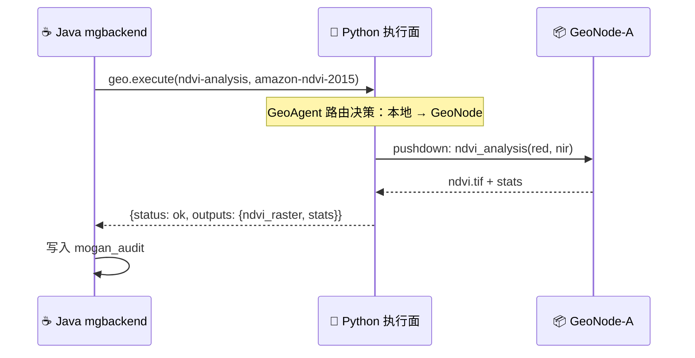
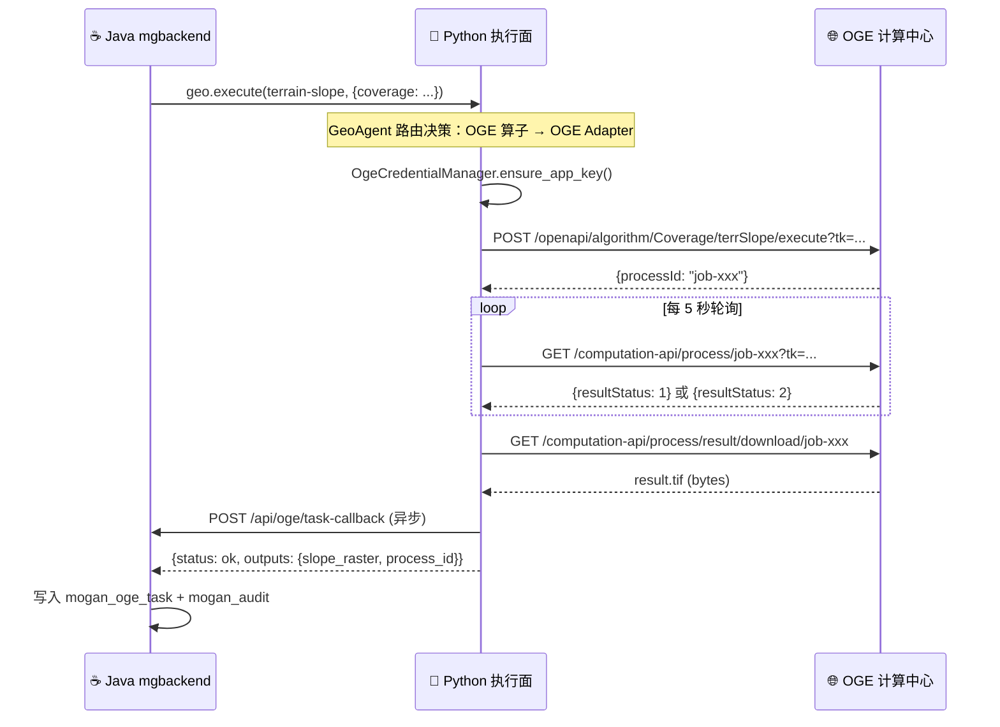

# RuoYi 后台 ↔ Python 执行面 —— "管算"协同通信协议

> 本文档定义 Java mgbackend（RuoYi）与 Python 执行面（geonexus-execution-plane）之间的所有通信接口。

---

## 一、通信总览

```
┌─────────────────────────────────────────────────────────────────────┐
│  Java mgbackend (RuoYi) — 管理面                                    │
│                                                                     │
│  角色：用户管理、权限控制、GeoCard CRUD、审计追溯、配额管理           │
│  端口：8080（管理后台 API）                                          │
│  技术栈：Spring Boot + Spring Security + MyBatis + PostgreSQL       │
└──────────────────────┬──────────────────────────────────────────────┘
          │                            ▲
          │ ① GeoMCP (JSON-RPC 2.0)   │ ② REST 回调 / 轮询
          │ POST /geomcp              │ GET /api/oge/tasks/{id}
          │ geo.execute               │ POST /api/oge/audit-callback
          │ geo.capabilities          │
          │ geo.describe              │
          ▼                            │
┌─────────────────────────────────────────────────────────────────────┐
│  Python 执行面 (geonexus-execution-plane) — 计算面                    │
│                                                                     │
│  角色：GeoMCP Server、Registry、GeoAgent、OGE Adapter、GeoNode 集群  │
│  端口：8787（GeoMCP）、8790（Registry）、8900（Web BFF）              │
│  技术栈：Python + FastAPI + geonexus-sdk + httpx                     │
└─────────────────────────────────────────────────────────────────────┘
```

## 二、通信协议

### 2.1 方向一：Java → Python（GeoMCP JSON-RPC 2.0）

Java 通过 `GeoMCPClient` 调用 Python 执行面的 4 个核心方法。

**接口 1：查询能力** — `geo.capabilities`

```java
// Java 调用
Map<String, Object> caps = geomcpClient.capabilities();
// 返回：{protocol, version, node, methods, skills, geocards}
```

**接口 2：查询详情** — `geo.describe`

```java
// Java 调用
Map<String, Object> desc = geomcpClient.describe(
    List.of("amazon-ndvi-2015"),  // GeoCard ID 列表
    List.of("ndvi-analysis")      // Skill 名称列表
);
// 返回：{geocards: [...], skills: [...]}
```

**接口 3：执行技能** — `geo.execute`（核心）

```java
// Java 调用 — 本地计算
ExecuteResult result = geomcpClient.execute(
    ExecuteRequest.of("ndvi-analysis")
        .geocards(List.of("amazon-ndvi-2015"))
        .spatial(new SpatialContext(List.of(-73.9, -15.0, -44.0, 5.0), "EPSG:4326"))
        .temporal(new TemporalContext("2015-01-01", "2015-12-31"))
        .params(Map.of("red", "/data/red.tif", "nir", "/data/nir.tif"))
        .requestId("req-001")
);

// Java 调用 — OGE 远程计算（与本地计算完全相同的接口）
ExecuteResult result = geomcpClient.execute(
    ExecuteRequest.of("terrain-slope")
        .params(Map.of(
            "coverage", "oge-user-data:myData/dem.tif",  // GeoCard ID 引用
            "outputName", "slope_result.tif"
        ))
        .requestId("req-002")
);
```

**接口 4：健康检查** — `geo.health`

```java
// Java 调用
Map<String, Object> health = geomcpClient.health();
// 返回：{status, node, version, checks: {registry, oge_connectivity, ...}}
```

### 2.2 方向二：Python → Java（REST 回调）

Python 执行面通过 HTTP 回调通知 Java 后台。

**回调 1：OGE 任务状态更新**

```
POST /api/oge/task-callback
Content-Type: application/json
X-API-Key: <mgbackend-api-key>

{
  "request_id": "req-002",
  "process_id": "job-xxx",
  "operator": "Coverage.terrSlope",
  "status": "succeeded",          // succeeded | failed | timeout
  "elapsed_seconds": 45.3,
  "result_metadata": {
    "cog_url": "http://oge/styles/cog/job-xxx",
    "output_path": "/data/oge/slope_result.tif"
  },
  "error": null
}
```

**回调 2：审计日志写入**

```
POST /api/oge/audit-callback
Content-Type: application/json
X-API-Key: <mgbackend-api-key>

{
  "request_id": "req-002",
  "action": "execute",           // execute | upload | delete
  "resource_type": "operator",   // operator | data | model
  "resource_id": "Coverage.terrSlope",
  "operator": "admin",
  "result": "succeeded",         // succeeded | failed
  "detail": {
    "process_id": "job-xxx",
    "elapsed_seconds": 45.3,
    "oge_endpoint": "http://openge.org.cn/api"
  },
  "timestamp": "2026-09-01T10:00:00Z"
}
```

### 2.3 方向三：Java → Python（REST 元数据同步）

**同步 1：GeoCard 变更通知**

```
POST /api/sync/geocard
Content-Type: application/json
X-API-Key: <execution-plane-api-key>

{
  "action": "upsert",               // upsert | delete
  "card": { ... 完整 GeoCard JSON ... }
}
```

Python 执行面收到后：
1. 更新本地 Registry（`RegistryClient.register(card)`）
2. 返回 `{status: "ok", card_id: "..."}`

**同步 2：OGE 凭证下发**

```
POST /api/sync/oge-credential
Content-Type: application/json
X-API-Key: <execution-plane-api-key>

{
  "endpoint": "http://openge.org.cn/api",
  "username": "oge-account",
  "password": "encrypted-password",     // 建议使用临时传输加密
  "client_id": "test",
  "client_secret": "123456"
}
```

Python 执行面收到后：
1. 更新 `OgeCredentialManager` 的配置
2. 刷新凭证（重新登录获取 JWT）
3. 返回 `{status: "ok", tk_valid: true, error: null}`

---

## 三、认证与安全

### 3.1 API Key 机制

| 方向 | 调用方 | 被调用方 | 凭证 | 说明 |
|------|--------|---------|------|------|
| Java → Python | mgbackend | execution-plane | `X-API-Key: <node-api-key>` | GeoMCP 的 `api_keys` 参数 |
| Python → Java | execution-plane | mgbackend | `X-API-Key: <mgbackend-api-key>` | 自定义 header |
| Java → Python | mgbackend | execution-plane | `X-API-Key: <node-api-key>` | 元数据同步 |

### 3.2 凭证生命周期

```
Java mgbackend                     Python 执行面
     │                                  │
     │ ① 管理员配置 OGE 凭证              │
     │ (管理后台 → OGE 凭证表单)           │
     │                                  │
     │ ② POST /api/sync/oge-credential  │
     │ ─────────────────────────────────→│
     │                                  │ ③ 初始化 OgeCredentialManager
     │                                  │ ④ 登录获取 JWT + 申请 tk
     │                                  │ ⑤ 缓存凭证
     │                                  │
     │ ⑥ 返回 {status: "ok"}            │
     │ ←─────────────────────────────────│
     │                                  │
     │ ⑦ geo.execute("terrain-slope")  │
     │ ─────────────────────────────────→│
     │                                  │ ⑧ 使用缓存 tk 调用 OGE
     │                                  │ ⑨ 到期自动续期
     │                                  │
     │ ⑩ callback 任务状态               │
     │ ←─────────────────────────────────│
```

### 3.3 凭证配置在 Java 管理后台的存储

```sql
-- Java 侧：mogan_oge_credential 表（加密存储）
CREATE TABLE mogan_oge_credential (
    credential_id  varchar(64) PRIMARY KEY,
    node_id        varchar(64),               -- 关联 mogan_geonode
    endpoint       varchar(256) NOT NULL,      -- OGE API 网关地址
    username       varchar(64) NOT NULL,
    password       varchar(128) NOT NULL,      -- AES 加密存储
    client_id      varchar(64),
    client_secret  varchar(128),               -- AES 加密存储
    app_name       varchar(128),               -- 应用名称
    status         varchar(16) DEFAULT 'active', -- active | error | expired
    last_sync_at   timestamp,                   -- 最后同步到 Python 的时间
    last_error     varchar(500),
    del_flag       char(1) DEFAULT '0',
    create_by      varchar(64), create_time timestamp,
    update_by      varchar(64), update_time timestamp,
    remark         varchar(500)
);
```

---

## 四、执行流程

### 4.1 本地执行（NDVI 示例）



### 4.2 OGE 远程执行（地形分析示例）



---

## 五、"管算"协同接口清单

### 5.1 Java 侧提供的接口（供 Python 调用）

| 方法 | 路径 | 说明 | 频率 |
|------|------|------|------|
| POST | `/api/oge/task-callback` | OGE 任务状态回写 | 任务完成时 |
| POST | `/api/oge/audit-callback` | 审计日志写入 | 每次执行后 |
| POST | `/api/oge/credential-request` | Python 请求当前凭证配置 | 启动时，凭证刷新时 |

### 5.2 Python 侧提供的接口（供 Java 调用）

| 方法 | 路径 | 说明 | 协议 |
|------|------|------|------|
| POST | `/geomcp` | GeoMCP 分发（核心） | JSON-RPC 2.0 |
| GET | `/health` | 健康检查 | HTTP |
| GET | `/capabilities` | 能力查询 | HTTP |
| POST | `/api/sync/geocard` | GeoCard 变更同步 | REST |
| POST | `/api/sync/oge-credential` | OGE 凭证下发 | REST |

### 5.3 Java 管理后台的 OGE 凭证管理页面

| 字段 | 类型 | 说明 |
|------|------|------|
| 凭证名称 | text | 标识，如 "武大 OGE 正式环境" |
| OGE 网关地址 | url | 如 http://openge.org.cn/api |
| 用户名 | text | OGE 平台账号 |
| 密码 | password | AES 加密存储 |
| OAuth Client ID | text | 默认 test |
| OAuth Client Secret | text | 默认 123456 |
| 应用名称 | text | 如 geonexus-mg-01 |
| 状态 | status | active / error / expired |
| 最后同步 | timestamp | 上次同步到 Python 的时间 |
| 测试连接 | button | 调用 Python `/health` 验证凭证 |

---

## 六、部署拓扑

```
                        ┌──────────────┐
                        │  Nginx 反向代理  │
                        │  /api/* → Java  │
                        │  /geomcp → Python│
                        └──────┬───────┘
                               │
              ┌────────────────┼────────────────┐
              │                │                │
              ▼                ▼                ▼
┌──────────────────────┐ ┌──────────────────────────┐
│ Java mgbackend:8080  │ │ Python 执行面:8787        │
│ RuoYi 管理后台       │ │ GeoMCP Server            │
│ PostgreSQL:5432     │ │ │
│ OGE 凭证表           │ │ Registry:8790            │
│ 审计表               │ │ Web BFF:8900             │
│ 任务表               │ └──────────────────────────┘
└──────────────────────┘
```

**网络要求**：
- Java mgbackend 和 Python 执行面必须在同一内网（延迟 < 5ms）
- Python 执行面需要访问 OGE 计算中心（外网）
- 管理后台前端（浏览器）只需访问 Java mgbackend

---

## 七、健康检查与监控

### 7.1 Python 执行面 /health 端点

```json
{
  "status": "ok",
  "node": "execution-plane-01",
  "version": "1.0.0",
  "protocol": "geomcp",
  "protocol_version": "1.0.0",
  "time": "2026-09-01T10:00:00Z",
  "checks": {
    "registry": "ok",
    "oge_connectivity": "ok",
    "oge_credential_valid": true,
    "llm_connectivity": "ok",
    "skills_loaded": 7,
    "geocards_registered": 12
  }
}
```

### 7.2 Java 侧定时探测

```java
// Java 定时任务（Quartz），每 30 秒探测一次
@Scheduled(fixedRate = 30000)
public void checkExecutionPlaneHealth() {
    try {
        Map<String, Object> health = geomcpClient.health();
        if (!"ok".equals(health.get("status"))) {
            // 告警：执行面异常
            alertService.send("执行面状态异常: " + health);
        }
        // 更新执行面状态到 mogan_geonode 表
        nodeService.updateHealth("execution-plane", health);
    } catch (Exception e) {
        // 告警：执行面不可达
        alertService.send("执行面不可达: " + e.getMessage());
        nodeService.updateHealth("execution-plane", Map.of("status", "down"));
    }
}
```