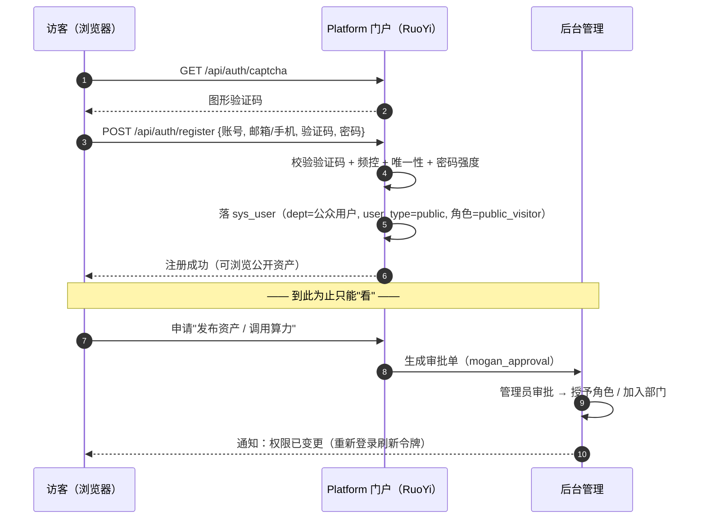
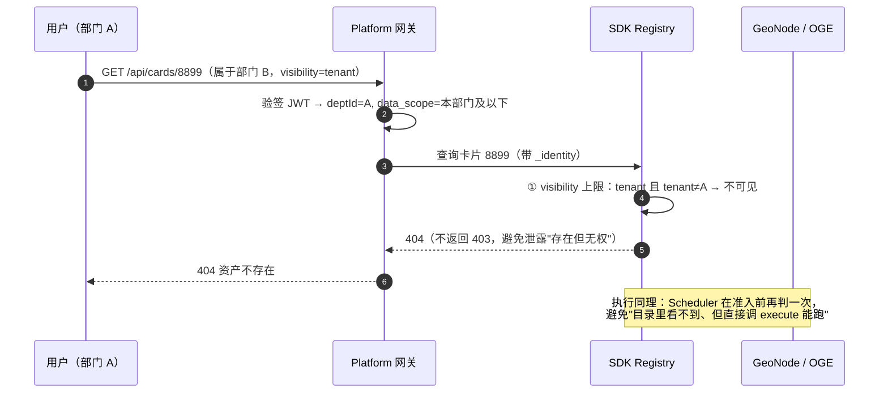

# 用户管理设计：账号 · 注册 · 权限 · 个人中心

> 范围：本文件只讲**用户管理这一块**（注册、认证、权限、个人中心、后台管理），
> 架构全景见 `docs/platform-architecture.md`（心脏 / 大脑 / 手脚 / 资源），
> Java↔Python 通信见 `docs/ruoyi-integration-protocol.md`。
> 计划对应：《第二突击队攻坚任务周计划表》莫干地球系统 **2.5 个人中心**、**2.6 运维管理（后台管理系统）**。

---

## 一、五条设计原则

1. **一个账号中心**：`sys_user` 是唯一账号表。公众、机构、服务三类账号都在里面，
   用**部门树 + 角色 + 账号类型**区分，**不做第二套用户表**。
2. **Platform（RuoYi）是唯一身份权威**：只有它签发令牌；SDK、GeoKG、OGE-GeoNode 都是**资源服务器**，只验签。
3. **注册 ≠ 授权**：自助注册只拿到"能看"的最低角色；要"能做"必须走审批。机构用户一律管理员开户。
4. **个人中心是聚合视图，不落副本**：把四个系统里**已经带用户归属**的数据聚起来，不再存一份。
5. **权限必须被"执行"，不能停在 Java 里**：数据范围要投影成 GeoCard 的可见性字段，
   由 SDK 在**发现**与**执行**两处强制执行——否则绕过 Java 就能拿到越权资产（本设计最要紧的一条）。

---

## 二、账号模型：一张表 + 三种账号类型

| 账号类型 | `user_type` | 谁 | 开户方式 | 默认角色 | 可否登录 Web |
|---|---|---|---|---|---|
| **公众账号** | `public` | 开放社区访客、外部研究者 | **自助注册**（邮箱/手机验证） | `public_visitor` | 门户可，后台不可 |
| **机构账号** | `staff` | 攻坚团队、合作单位、运维管理员 | **管理员在部门树内开户 / Excel 批量导入** | 按部门与岗位定 | 门户 + 莫干系统 + 后台（按菜单权限） |
| **服务账号** | `service` | 系统间调用、第三方应用接入 | **开发管理模块签发**（app_id / app_secret） | `svc_*` | **不可登录**（无自然人） |

账号类型只决定"怎么来的、能不能登录"，**权限一律由角色决定**——避免把权限判断散落到类型分支里。

### 组织与角色的挂载（RuoYi 原生模型）

```
sys_dept（部门/单位树，ancestors 存祖链）
   └── sys_user（用户，dept_id 指向所属部门）
          ├── sys_user_role ──▶ sys_role（角色）
          │                       ├── sys_role_menu ──▶ sys_menu（菜单/按钮权限 perms）
          │                       ├── sys_role_dept ──▶ sys_dept（数据范围=自定义时用）
          │                       └── data_scope（1 全部 / 2 自定义 / 3 本部门 / 4 本部门及以下 / 5 仅本人）
          └── sys_user_post ──▶ sys_post（岗位，仅用于标识与统计，不直接决定权限）
```

**部门树是权限的骨架**：攻坚团队按"小组"（如小组6 卫星智能服务攻关小组、小组7 SDG 评价服务攻关小组）
建部门，合作单位按单位建部门，公众账号统一挂在一个独立的 `公众用户` 根部门下——
这样"批量停用某个单位"或"按单位统计用量"都有抓手。

---

## 二·五、访问模型：游客可看 / 登录可用 / 授权才能管

> 这一节是 UI 与路由的**硬约束**。曾经把"需要权限"误当成"需要登录"，结果整站被弹到登录页 ——
> 游客浏览资讯、地图与目录不该被打断。判定逻辑在 `frontend/src/router/access.js`（纯函数，有单测）。

| 档位 | 谁的 | 典型页面 | 依据 |
|---|---|---|---|
| **public（游客可看）** | 未登录即可 | 门户首页 · 可视化地球 · 全球案例 · 数据资源 · 算子模型 · 算力平台 · 开放社区 · 超级智能体 · 典型应用；莫干地球系统的 首页 · 地图 · GeoCard · 案例中心 | 浏览公开数据与资讯不需要身份 |
| **auth（登录可用）** | 任意已登录账号 | 智能工作台 · 个人中心 · 案例的"一键复跑"动作 | 涉及复杂空间分析、计算或模拟 |
| **perm（授权才能管）** | 具备对应 scopes | 后台管理（`system:user:list`）· 发布资产（`card:publish`，后续） | 管理动作，公众账号需审批后才拥有 |

**三条实现原则**：

1. **不重定向，就地引导**：需要登录/权限时**不跳转**登录页，而是在页内给出说明与入口
   （`AccessGate`），URL 与上下文都保留，登录后按 `redirect` 回到原页。深链可分享、可收藏。
2. **入口可见但不隐藏**：侧栏与贴片导航对游客显示**全部**入口，只在需要登录/权限的项上打
   `需登录` / `需权限` 角标。把入口藏起来会让游客以为"没有这个功能"。
3. **动作级与页面级分开**：案例中心本身 public，但"一键复跑"按钮在未登录时禁用并提示
   "需登录后复跑" —— 能看 ≠ 能做，与"注册 ≠ 授权"是同一条原则。

**后端对应**：目录与案例的读接口匿名可用（`GET /api/cases`、`/api/sdk/geocards`、`/api/geokg/*`）；
提交执行（`POST /api/cases/:id/run`）、审批、配额、后台管理都要求令牌。越权一律 401/403，
不泄露对象是否存在（对象级场景返回 404）。

## 三、用户注册与开户

### 3.1 三条路径

| 路径 | 入口 | 关键校验 | 结果 |
|---|---|---|---|
| **A. 公众自助注册** | 门户「开放社区」→ 注册 | 图形验证码 + 邮箱/手机验证码 + 频控（同 IP/手机号/邮箱）+ 唯一性 | 落 `公众用户` 部门，角色 `public_visitor`，状态**正常但受限** |
| **B. 机构开户** | 后台「用户管理」→ 新增 / 导入 | 部门必选 + 岗位 + 初始角色 + 初始密码（首登强制改密） | 落对应部门，按角色授权，`pwd_update_date` 置空触发强制改密 |
| **C. 服务账号签发** | 后台「开发管理」→ 应用 | 归属部门 + 可用接口白名单 + 配额 + 有效期 | 落 `mogan_app` 表，**不建 `sys_user` 账号**（无自然人） |

### 3.2 公众注册时序（含"注册≠授权"）



### 3.3 注册校验规则（前后端一致）

| 项 | 规则 |
|---|---|
| 用户名 | 4–20 位，`[A-Za-z0-9_-]`，全局唯一（唯一索引，冲突返回友好提示） |
| 手机 / 邮箱 | 二选一必填；格式校验 + **验证码校验** + 唯一性 |
| 密码 | ≥10 位，含大小写字母 + 数字 + 符号中至少三类；**不得包含用户名**；不与最近 5 次重复（RuoYi `pwd_update_date` + 历史表） |
| 频控 | 同 IP 10 次/小时、同手机号 5 次/天、同邮箱 5 次/天 |
| 反自动化 | 图形验证码（RuoYi 原生）+ 注册接口滑动窗口限流 |

---

## 四、认证与会话

### 4.1 登录方式

| 方式 | 适用 | 说明 |
|---|---|---|
| 账号密码 + 图形验证码 | 全部 | RuoYi 原生；失败 5 次锁定 10 分钟（`sys_logininfor` 记录） |
| 手机验证码登录 | 公众 | 便捷入口，登录后同样落 `sys_user` |
| 单点登录 SSO | 门户 / 莫干地球系统 / 后台 三方互认 | 同一 `sys_user`，一次登录三处可用，登出一处全退 |
| 第三方（微信 / GitHub 等，可选） | 公众 | **仅作为注册来源**，账号仍落 `sys_user`，不引入第二身份源 |

### 4.2 令牌契约（四系统共同遵守）

**Platform 唯一签发，其余只验签。** RS256 JWT：

| Claim | 含义 | 谁校验 / 用途 |
|---|---|---|
| `sub` / `userId` | 账号 id | 全部 |
| `userName` / `nickName` | 展示名 | 前端 |
| `deptId` / `deptPath` | 部门与祖链 | 数据范围判定（SDK / OGE） |
| `tenant` | 租户 / 单位标识 | 与 GeoCard `tenant` 字段对齐 |
| `accountType` | `public` / `staff` | 边界收口（公众不得调算力） |
| `roles` | 角色 key 列表 | 粗粒度门禁 |
| `scopes` | 细粒度授权（`card:publish`、`oge:execute`…） | 接口级门禁 |
| `jti` / `exp` / `iat` | 唯一 id、过期、签发时间 | 黑名单（登出 / 踢人 / 停用） |

- 有效期：**access 30 分钟 + refresh 7 天**；refresh 可吊销。
- 公钥分发：`GET /.well-known/jwks.json`；四系统**缓存公钥**，轮换不停机（`kid` 匹配）。
- **立即失效**：改密 / 停用 / 调岗 / 登出 → `jti` 进黑名单（Redis，TTL = 剩余有效期），网关与各资源服务器都查。

### 4.3 会话与安全

- 多端登录：默认允许（移动 + 桌面），可在"安全设置"里"登出其他设备"。
- 敏感操作二次确认：改密、换绑手机/邮箱、签发服务账号、转交资产、删除资产。
- 密码找回：邮箱/手机验证码重置 → 置 `pwd_update_date` 为空 → **强制改密**并不允许与旧密码相同。

---

## 五、权限管理：三段式

> 三段分别回答三个不同的问题：**能不能点**（功能）、**能看哪些**（数据）、**能用多少**（配额）。
> 混成一段是权限系统最常见的设计错误。

| 段 | 权威定义 | 执行点 | 落到 GeoNexus 的哪里 |
|---|---|---|---|
| ① **功能权限** | `sys_menu.perms`（按钮级，如 `system:user:add`） | 前端隐藏 + 后端注解 | 门户 / 莫干系统 / 后台的全部接口 |
| ② **数据与资源权限** | `sys_role.data_scope` + `sys_role_dept` | **SDK Registry 过滤 + Security 网关** | GeoCard 的 `visibility` / `tenant` / `owner`（需新增，加法式扩展） |
| ③ **配额与算力额度** | 配额模块（`mogan_quota`） | **SDK Scheduler 准入** + OGE 调用限额 | `ResourceRequirement` 预约、并发上限、OGE 调用/存储额度 |

### 5.1 数据权限如何投影到 GeoCard（关键）

RuoYi 的 `data_scope` 只在 Java 里做 SQL 过滤是**不够的**——Python 侧（SDK / GeoKG / OGE）会绕过它。
所以定义一条**双向取交集**的规则：

```
可见 ⟺ owner/tenant 命中授权范围（data_scope）  ∩  visibility 允许（安全上限）
```

| `data_scope` | 投影到 GeoCard 的过滤条件 |
|---|---|
| 1 全部数据 | 不限部门，**但仍受 visibility 上限约束** |
| 2 自定义数据 | `owner ∈ 指定部门（sys_role_dept）的用户集合` |
| 3 本部门数据 | `tenant = 用户 deptId` |
| 4 本部门及以下 | `tenant ∈ dept 子树（ancestors 前缀匹配）` |
| 5 仅本人数据 | `owner = 用户 userId` |

| GeoCard `visibility` | 含义 | 谁能看 |
|---|---|---|
| `public` | 公开（公共产品） | 任何人（含未登录游客） |
| `tenant` | 单位内共享 | 同 `tenant`（或其上级部门，视 data_scope） |
| `private` | 仅本人 / 仅指定人 | `owner` + 显式授权名单 + 平台管理员（留审计） |

**判定顺序**：先判 `visibility` 上限（不安全直接拒），再判 `data_scope` 范围（不在范围内视为"不存在"，
返回 404 而非 403，避免泄露资产存在性）。

### 5.2 角色矩阵（初始建议，可按需增删）

| 角色 key | 归属 | 功能权限（要点） | 数据范围 | 配额 |
|---|---|---|---|---|
| `public_visitor` | 公众 | 浏览门户、查公开案例与数据、用知识问答 | 仅 `public` | 无算力 |
| `org_member` | 机构普通成员 | 门户 + 莫干系统（工作台、个人中心） | 本部门 | 小额度（按单位） |
| `org_publisher` | 机构资产管理员 | 上述 + 资产发布 / 上架（需审批） | 本部门及以下 | 中额度 |
| `org_admin` | 单位管理员 | 上述 + 本单位用户与角色管理 | 本部门及以下 | 本单位总额 |
| `platform_operator` | 平台运营 | 资源 / 服务 / 开发管理、审批、看板 | 全部（除 `private`） | — |
| `platform_admin` | 平台管理员 | 全部（含系统管理：用户 / 部门 / 角色 / 菜单 / 字典 / 参数） | 全部 | — |
| `auditor` | 审计员 | 只读日志与审计、导出 | 全部（只读） | — |
| `svc_node` | 服务账号 | 仅 GeoMCP / 同步接口白名单 | 按授权 | 独立配额 |

### 5.3 配额（第三段的落地）

- 配额挂在**部门**上（单位总额）与**用户**上（个人上限）两级，取小者生效。
- 扣减点：任务受理时预扣 → 结束按实际结算（失败可退）；OGE 远程调用按次/按时长计量。
- 与 SDK 的衔接：平台把"用户/部门可用额度"换算成 `ResourceRequirement` 与并发上限下发；
  SDK 的 `Scheduler` 在**准入**阶段拒绝而不是执行到一半才失败（拒绝要带理由）。
- 观测：个人中心展示"我的配额"，后台看板展示"各单位用量 Top"。

---

## 六、个人中心（2.5）：聚合视图，不建副本

**设计要点：个人中心没有自己的用户表，也没有"我的数据"副本。**

| 板块 | 权威来源 | 取数方式 |
|---|---|---|
| 我的资料 | `sys_user` | 本地 |
| 安全设置（改密 / 绑定 / 两步验证 / 登出其他设备） | `sys_user` + 令牌黑名单 | 本地 |
| 我的组织与角色（只读） | `sys_dept` / `sys_role` | 本地 |
| **我的任务** | SDK **GeoTask**（`task list/show/events` + SSE 实时） | 按 `_identity` 过滤 |
| **我的资产** | GeoCard 目录（`owner`/`tenant`/`visibility`）+ OGE 资源授权 | Registry 按身份查 |
| 我的案例 | 平台案例中心 | 本地 |
| 我的知识 | GeoKG 我 / 我单位贡献的实体与数据集 | `GET /api/v1/geokg/search?contributor=` |
| 我的配额 | `mogan_quota` + Scheduler 实时占用 + **OGE 计量**（OGE 侧只看到平台这个应用，用量必须平台自己记） | 本地 + SDK + 平台记账 |
| 我的消息 | `sys_notice` + 系统通知 | 本地 |
| 我的审计 | `sys_logininfor` / `sys_oper_log` / `mogan_audit` | 本地 |
| 我的申请 | `mogan_approval`（我提交的发布 / 提权申请及状态） | 本地 |

**为什么必须这样切**：任何"再存一份"都会立刻产生第 5 套用户数据——改密不同步、离职不回收、
统计口径打架。个人中心的写操作**只有**：改资料、改偏好、改密码、绑定、登出、撤销申请。

**接口**（统一身份上下文，跨系统统一返回 `{items, total, source}`，前端标注"数据来自哪个系统"）：

```
GET  /api/me                 GET/PUT /api/me/profile     PUT /api/me/password
POST /api/me/bind            POST /api/me/logout-others  GET /api/me/roles
GET  /api/me/tasks           GET /api/me/assets           GET /api/me/cases
GET  /api/me/knowledge       GET /api/me/quota            GET /api/me/notices
GET  /api/me/audit           GET /api/me/applications
```

---

## 七、后台管理（2.6）：RuoYi 系统管理 + 扩展菜单

| 后台模块 | 来源 | 说明 |
|---|---|---|
| 用户管理 / 部门管理 / 岗位管理 / 角色管理 / 菜单管理 / 字典管理 / 参数设置 / 通知公告 / 日志管理 | **RuoYi 原生直接用** | 不重复开发；`data_scope` 在角色上配置 |
| 资源管理 | **扩展菜单** | 数据 / 模型 / 算子 / 算力登记与上下架；平台只存"目录 + 授权"，实体在节点 |
| 服务管理 | **扩展菜单** | 服务注册 / 启停 / 配额；配额下发 SDK 与 OGE |
| 开发管理 | **扩展菜单** | 服务账号（app_id/secret）、接口授权白名单、调用统计 |
| 审批管理 | **扩展菜单** | 资产发布 / 上架 / 提权；与消息通知联动 |
| 运营看板 | **扩展菜单** | 资源规模、调用量、任务成功率、各单位用量 |
| **配额管理** | **扩展菜单** | 部门 / 用户额度、消耗与结算 |

**与 OGE「6.管理中心」的边界**：账号与权限**只在平台后台**；OGE 管理中心只管
**资源与服务自身的运维**（资源上下架、服务注册、开发管理），**不存用户表**，只存"谁能调用"的授权关系。

---

## 八、跨系统怎么落地

### 8.1 四个系统的角色都是"资源服务器"

| 系统 | 接谁的令牌 | 校验方式 | 写操作门禁 |
|---|---|---|---|
| **Platform** | 自己签发 | 本地 | `sys_menu.perms` + 数据范围 |
| **SDK**（GeoMCP / 执行面） | Platform | 服务 API Key（证明"是平台"）+ **用户 JWT 透传**（证明"代表谁"） | `scopes`（如 `oge:execute`） |
| **GeoKG** | Platform | 读：白名单可匿名；写：JWT + `scopes`（`kg:write`） | 仅"知识运营"角色可写 |
| **OGE（独立系统）** | 不接平台令牌 | 平台用自己在 OGE 的**应用凭证**（`mogan_oge_credential`）换 `tk` 调其后端 API；OGE 侧只认识平台这个应用 | 按 OGE 侧主权级别（`sovereignty`）与授权关系；**用户级权限由平台自己兜** |

### 8.2 用户上下文透传格式（Java → Python）

```jsonc
// GeoMCP 请求 params 里附带，执行面据此做可见性过滤与配额扣减
"_identity": {
  "userId": 1024, "userName": "zhangsan", "deptId": 200, "deptPath": "0,100,200",
  "tenant": "org-wuhan", "accountType": "staff",
  "roles": ["org_member"], "scopes": ["card:read", "oge:execute"],
  "jti": "b7c1…", "exp": 1790000000
}
```

**红线**：执行面**不得**用服务账号身份冒充用户。若请求没有 `_identity`，只能执行"公共资产 + 平台级"
操作，且审计里标记为 `svc_*`；反过来，服务账号不能携带用户 `_identity` 提升自己的数据范围。

### 8.3 与 OGE 账号域的关系（重要）

OGE 是**独立系统**，有**自己的用户注册与登录**。因此存在**两个账号域**：

| | 平台账号域 | OGE 账号域 |
|---|---|---|
| 权威 | Platform / RuoYi `sys_user` | OGE 自有注册系统 |
| 服务对象 | 门户、莫干地球系统、后台的全部用户 | OGE 的直接用户（其他机构 / 公众直接上 OGE） |
| 本平台如何使用 | 用户在这里注册登录 | **普通用户不需要 OGE 账号**：平台用应用凭证代表用户调用 OGE 后端能力 |

**四条规则**：

1. **不做账号联邦**：不用 OGE 账号登录本平台，也不用平台账号登录 OGE 前端——身份权威只能有一个。
2. **凭证托管**：平台在 OGE 的应用凭证存 `mogan_oge_credential`（AES 加密），由执行面的
   `OgeCredentialManager` 运行时换取 `tk` 并自动续期；前端与浏览器**永远拿不到** OGE 凭证。
3. **记账在平台**：因为 OGE 侧只认识平台这个应用，**用量与配额必须由平台自己记**
   （`mogan_quota` + `mogan_audit`），否则没法回答"这个算子是谁用的、用了多少"。
4. **禁止影子账号**：若某单位确实需要在 OGE 侧独立开户（要直连 OGE 前端做管理），
   由**平台管理员代理开户**并在 `mogan_oge_account_map` 登记映射；
   **不允许用户自行注册**——平台视野外的账号既记不到账，也管不住权限回收。

### 8.4 审计（两处都要落，且可关联）

| 记录 | 位置 | 内容 |
|---|---|---|
| 登录日志 | `sys_logininfor` | 谁、何时、何 IP、成功/失败原因 |
| 操作日志 | `sys_oper_log` | 谁、对哪个接口、参数摘要、结果 |
| 任务/执行审计 | `mogan_audit` | 谁（`_identity`）、执行了什么、用了哪个节点、产物在哪 |
| 关联键 | `request_id` | 平台请求 ↔ GeoMCP 调用 ↔ 节点执行 三段串起来 |

---

## 九、关键流程：越权怎么被拦住



---

## 十、数据模型：哪些用 RuoYi 原生，哪些是本项目扩展

| 表 | 来源 | 用途 |
|---|---|---|
| `sys_user` / `sys_dept` / `sys_post` / `sys_role` / `sys_menu` / `sys_user_role` / `sys_user_post` / `sys_role_menu` / `sys_role_dept` | **RuoYi 原生** | 账号、组织、角色、菜单权限、数据范围 |
| `sys_dict_type` / `sys_dict_data` / `sys_config` / `sys_notice` / `sys_logininfor` / `sys_oper_log` | **RuoYi 原生** | 字典、参数、通知、登录与操作日志 |
| `mogan_geocard` | 已有 | 资产目录（新增 `owner` / `tenant` / `visibility` 字段） |
| `mogan_oge_credential` | 已有 | OGE 凭证（加密存储 + 下发执行面） |
| `mogan_audit` | 已有 | 任务 / 执行审计 |
| `mogan_app` | **新增** | 服务账号（app_id / secret 哈希 / 白名单 / 配额 / 有效期） |
| `mogan_quota` | **新增** | 部门 / 用户配额与消耗 |
| `mogan_approval` | **新增** | 审批单（发布 / 上架 / 提权） |
| `mogan_asset_acl` | **可选** | 资产级显式授权（`private` 资产的授权名单） |
| `mogan_oge_account_map` | **可选** | 平台用户 ↔ OGE 账号映射（仅代理开户时用，见 8.3） |

> 新表沿用既有 `mogan_` 前缀（若依风格：系统表 `sys_`、业务表按模块前缀）。

---

## 十一、可验收判据（每条都能写成测试用例）

| # | 判据 | 期望 |
|---|---|---|
| 1 | A 部门用户请求 B 部门 `tenant` 资产 | 404（不是 403，不泄露存在性） |
| 2 | 把 `public` 资产改为 `private` 后，`data_scope=1` 的普通用户访问 | 拒绝（可见性上限优先于数据范围） |
| 3 | 停用用户后，其未过期 access token 继续调用 | 立即被拒（`jti` 黑名单） |
| 4 | `public_visitor` 调 `geo.execute` / OGE 算子 | 403，且不产生配额消耗 |
| 5 | **删库重建**（清空业务表）后，个人中心仍能展示任务 / 资产 / 案例 / 知识 | 可展示 → 证明"没有副本" |
| 6 | 服务账号携带用户 `_identity` 提权 | 拒绝（服务账号不得冒充自然人） |
| 7 | 一次跨系统执行 | `sys_oper_log` 与 `mogan_audit` 均有记录，且 `request_id` 可关联 |
| 8 | 换绑手机后旧令牌 | 失效（`jti` 黑名单 + 强制重新认证） |

---

## 十二、与 12 周计划的对应

| 周次（莫干地球系统 2.5 / 2.6） | 本设计的动作 |
|---|---|
| W1–W2（账号体系与权限模型 / 后台框架） | 第二节账号模型 + 第三节三条准入路径；RuoYi 系统表落地 |
| W3（用户与组织管理 / 我的任务） | 第七节用户 / 部门管理；第六节"我的任务"接 GeoTask |
| W4（资源与服务管理 / 我的资产） | 第七节扩展菜单；第六节"我的资产"接 Registry |
| W5（开发管理 / 消息与审计） | `mogan_app` + 第六节消息与审计板块 |
| W6（审批流 / 运营看板 / 10.31 开发完成） | `mogan_approval` + 看板；三段式权限全部打通 |
| W7–W8（联调 + 内测，11.15 前） | 第十一节 8 条判据逐条验证（越权、令牌失效、可见性上限） |
| W9–W11（上线 + 试运行，12.6 前） | 公众注册开放、配额结算、审计核对 |
| W12（验收移交） | 权限与审计复核；管理员手册与用户手册 |

---

## 十三、待决事项

1. **公众账号是否实名**：影响开放社区的可做范围与合规口径（建议：浏览不实名，发布/调算力需实名）。
2. **门户与莫干地球系统是否共用账号**：本设计按**共用**（同一 `sys_user`，靠角色区分）；
   若对外门户必须物理隔离，需另设计"账号映射"，**不能复制用户表**。
3. **RuoYi 版本选择**：`RuoYi-Vue`（原生，需自建服务账号表）与 `RuoYi-Vue-Plus`（自带 `sys_client`、多租户）取舍会影响 `mogan_app` 是否必要。
4. **配额计量单位**：按"核时 + 存储 GB·天"还是按"任务数"，需与 OGE 计费口径对齐。
